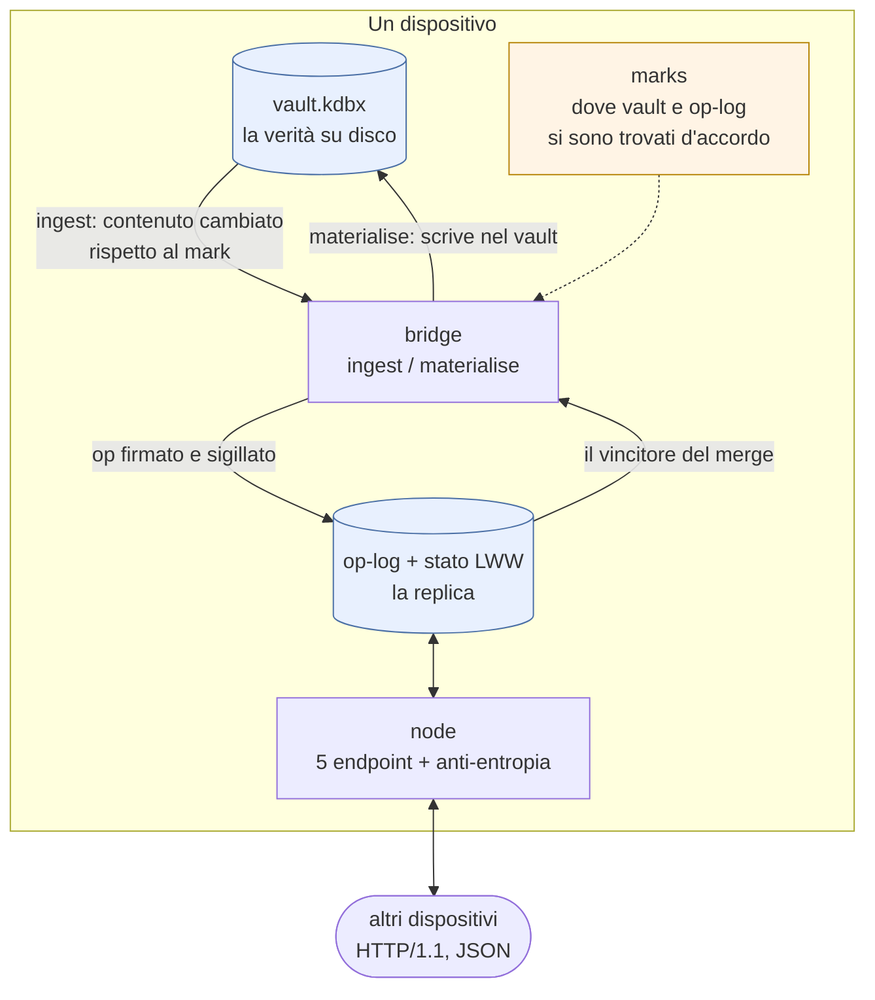
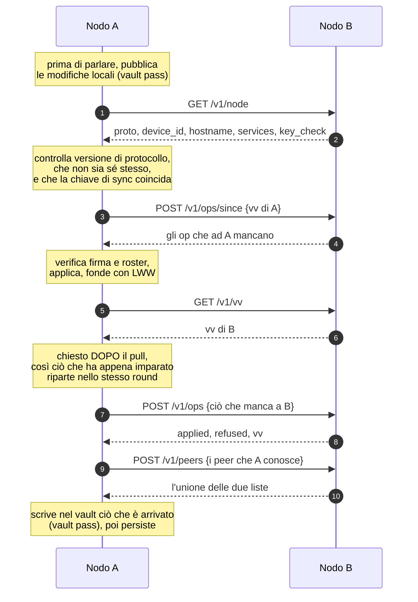
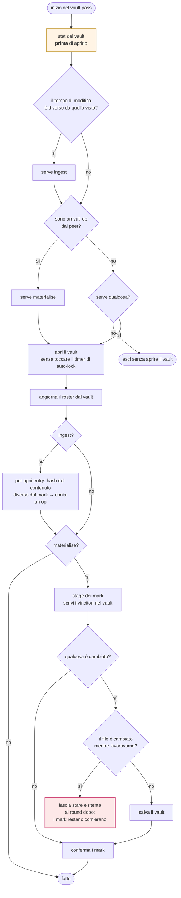
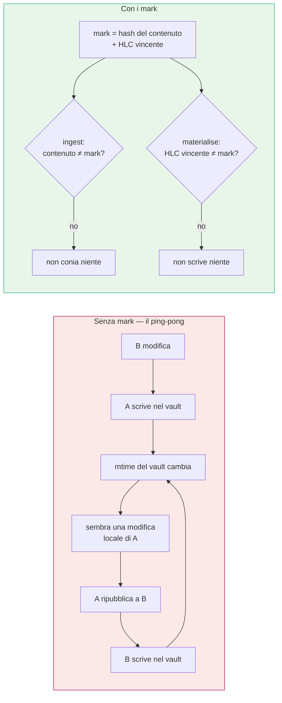
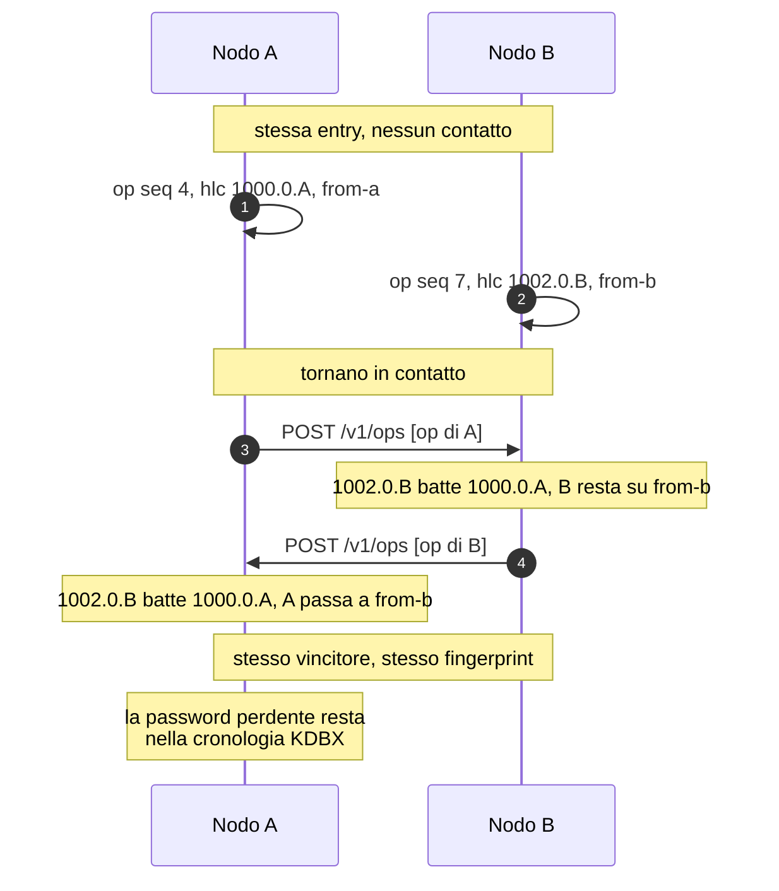
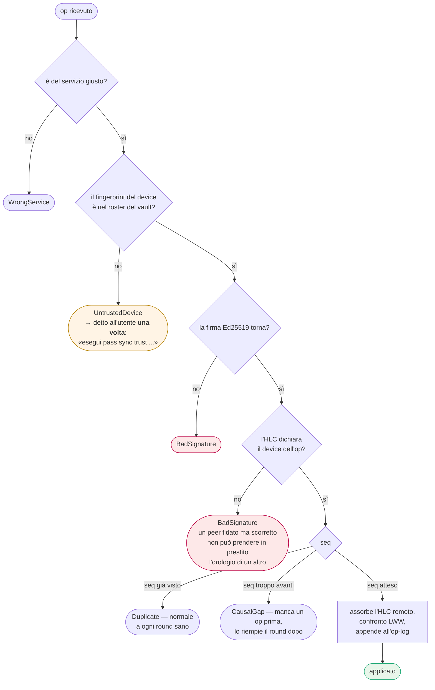
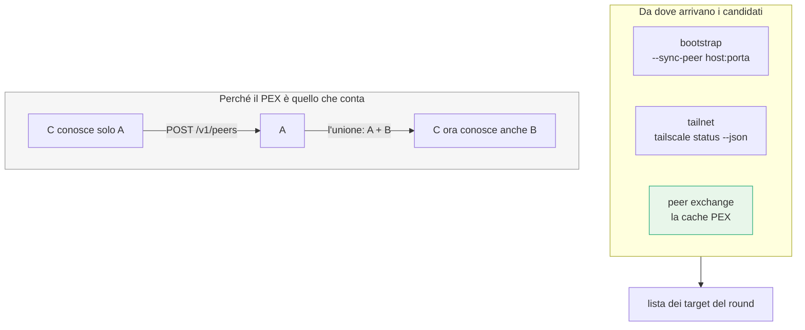
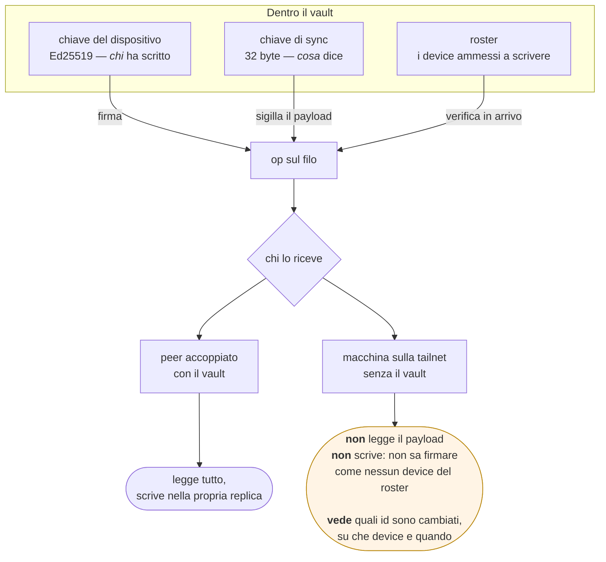
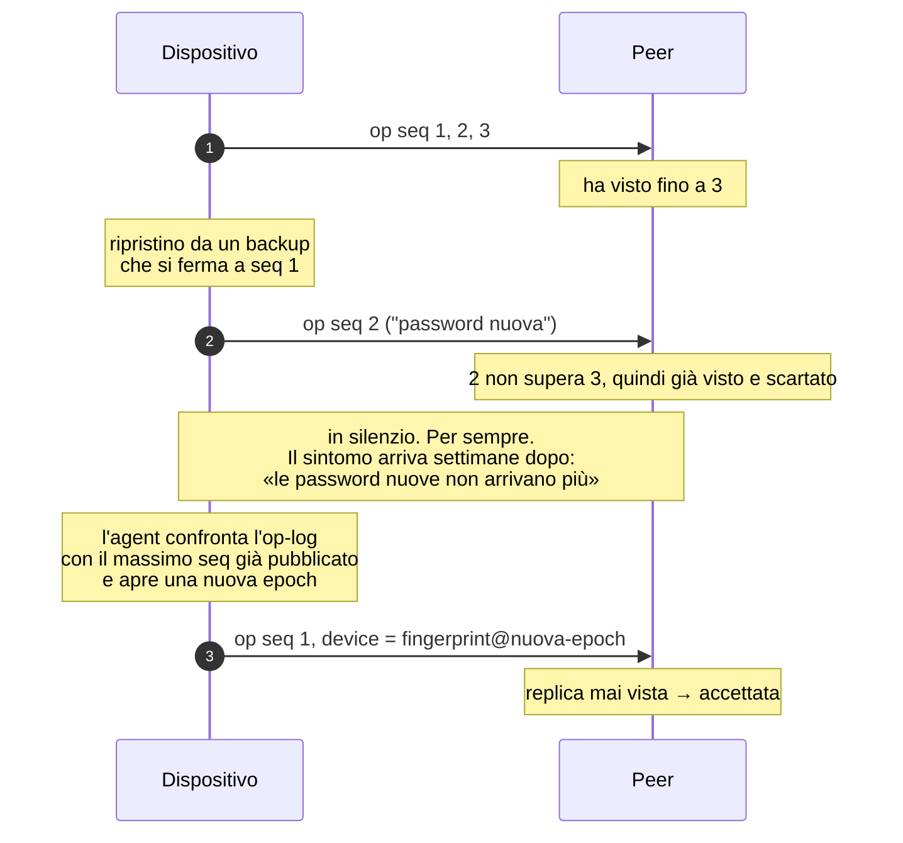
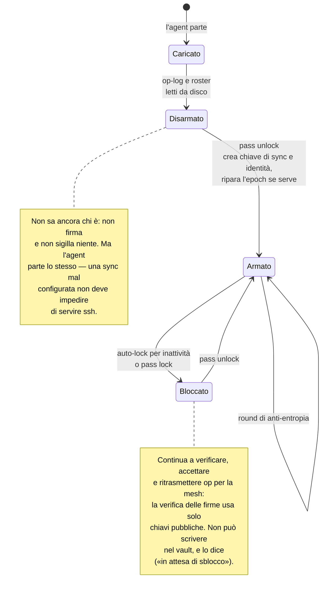

# I flussi della sincronizzazione peer-to-peer

> Complemento a [SYNC_STRATEGY.md](SYNC_STRATEGY.md), che spiega **perché** le
> cose stanno così. Qui c'è **come si muovono**, in diagrammi. Il codice sta
> in [`passlib::sync`](../passlib/src/sync/) per la regola di merge e in
> [`pass-agent/src/sync/`](../pass-agent/src/sync/) per tutto ciò che tocca il
> mondo esterno.

---

## 1. Gli strati, e in che verso scorrono

Il vault resta un file KDBX4 che KeePassXC apre: l'op-log è un *changelog
davanti* al vault, non il formato di archiviazione. Cancellalo e non perdi
niente se non la capacità di rispondere in fretta a "cos'è cambiato da quando
il tuo version vector diceva 7".



I `marks` non sono decorazione: sono l'unica cosa che impedisce alle due
direzioni di rincorrersi. Vedi §4.

---

## 2. Un round di anti-entropia

Simmetrico e senza stato condiviso. Gira identico su ogni piattaforma,
compresi i client che non possono essere *chiamati* — un iPhone in background
non tiene un listener aperto, quindi guida lui i propri round.



**Il verso doppio del peer exchange non è ridondanza.** Se A non contatta mai
B, A non impara mai che B esiste, e un terzo nodo che parte da A resta cieco
su B: la scoperta dipenderebbe dall'ordine di avvio.

**La correttezza sta nel round periodico, non nelle notifiche.** Un push che
si perde, un peer spento, una rete che torna dopo venti minuti: il round dopo
riconcilia comunque, perché è un confronto completo di version vector e non un
aggiornamento incrementale che qualcuno deve ricevere.

---

## 3. Il passaggio sul vault

Aprire il vault è Argon2id a 64 MiB — centinaia di millisecondi *per
costruzione*. Quindi non si apre se non c'è motivo: a regime un round non
costa nessun lavoro sul vault.



Due dettagli che sembrano paranoia e sono cicatrici:

- **Lo `stat` va fatto prima di aprire il vault, non dopo.** Farlo dopo perde
  scritture: un `pass add` che atterra *durante* il passaggio lascia un tempo
  di modifica che il passaggio registra come "già visto", pur avendo letto una
  versione precedente. Da lì in poi quella entry non viene pubblicata mai —
  non in ritardo, mai — finché qualcos'altro non tocca il file.
- **Il passaggio non tocca il timer di inattività.** L'auto-lock è una
  proprietà di sicurezza: una funzione di sfondo non deve poterla sospendere.

---

## 4. Perché le due direzioni non si rincorrono

Entrambe scattano sulla stessa osservazione — "vault e op-log non sono
d'accordo su questa entry". Senza un arbitro, due dispositivi si rimbalzano
una entry all'infinito: A scrive nel proprio vault la modifica di B, il che
cambia il tempo di modifica KDBX, il che sembra una modifica locale fresca,
che A ripubblica a B, e via.

Non è un'ipotesi: è esattamente ciò che si ottiene confrontando i timestamp,
perché scrivere una modifica remota **è** una scrittura locale per il KDBX.



Il mark è **l'hash del contenuto**, non un timestamp: dopo aver scritto la
modifica di un peer il contenuto coincide con il mark, quindi l'ingest non
conia nulla. I mark sono bookkeeping locale e non vengono mai replicati —
dicono cosa ha riconciliato *questo* dispositivo, che è una domanda diversa da
su cosa sono d'accordo le repliche.

---

## 5. Come si risolve un conflitto

Due dispositivi modificano la stessa entry mentre sono scollegati. Vince
l'HLC più alto, e l'ordinamento è `(millis, counter, device)`: il device in
coda è il tie-break deterministico, senza il quale due dispositivi che
scrivono nello stesso millisecondo sceglierebbero vincitori diversi e non
convergerebbero mai.



**Il perdente non è distrutto.** La scrittura passa da `Vault::update_entry`
come qualunque altra modifica, quindi la versione sovrascritta finisce nella
cronologia KDBX4 — visibile da `pass get` e da KeePassXC.

**Il fingerprint è lo strumento diagnostico.** È un hash della *decisione* di
merge — quale HLC ha vinto, cancellato o no — non del payload. Due repliche
convergenti stampano lo stesso valore: se `pass sync status` ne mostra due
diversi, il problema è il merge, non la rete.

---

## 6. Cosa succede a un op in arrivo



Duplicati e buchi causali sono **silenziosi**: sono lo stato normale di un
round sano. Un op da un dispositivo non accoppiato **non** lo è — quello è un
utente che sta cercando di accoppiare, e va detto, o l'accoppiamento sembra
rotto. Ma va detto una volta sola, o il messaggio che conta annega nel rumore.

---

## 7. Scoperta: tre sorgenti, una che conta



mDNS non è nell'elenco di proposito: il multicast non attraversa un router e
una tailnet non lo trasporta affatto, quindi il caso interessante — portatile
al bar, fisso a casa — è esattamente quello che mDNS non copre.

Dopo **un solo contatto** con un peer qualsiasi, un dispositivo conosce tutta
la mesh, e continua a conoscerla anche se domani Tailscale sparisce. È anche
il modo in cui un client che non vede `tailscaled` — un'app da App Store non
può parlare col suo socket — conosce la rete chiedendo a chiunque.

**Una porta per dispositivo, non per servizio.** Una porta convenzionale per
servizio costa N×M tentativi di connessione a ogni giro (6 device × 8 servizi
= 48 probe, quasi tutti in timeout) e collide: la 2283 identifica "qualcosa
che parla come Immich", non *il tuo* Immich. Qui `GET /v1/node` risponde con
tutti i servizi che quel dispositivo replica: N probe invece di N×M, e
aggiungere un servizio non tocca la scoperta.

---

## 8. Accoppiamento, e cosa vede chi

Due segreti fanno due lavori diversi. Confonderli è il modo classico di
costruire qualcosa che *sembra* cifrato e non autentica nessuno.



**L'accoppiamento è esplicito di proposito.** Fidarsi di chi si presenta
significherebbe che qualunque macchina in grado di raggiungere la porta può
cambiare le tue password: "è arrivato, quindi è mio" non è una decisione che
un password manager può prendere per conto tuo.

**Il trasporto è HTTP in chiaro, e non è una svista.** Riservatezza e
autenticità sono proprietà dell'*op*, non della connessione: è questo che
permette a una macchina sempre accesa e non fidata di fare da relay per
dispositivi che non sono mai svegli insieme. Un canale cifrato punto-a-punto
proteggerebbe *meno*, perché renderebbe il relay un partecipante fidato.

**Ciò che resta scoperto sono i metadati**, ed è scritto in
[SECURITY.md §6](../SECURITY.md) invece che nascosto: le richieste non sono
autenticate, quindi chiunque raggiunga la porta può scaricare l'op-log e
vedere quali UUID sono cambiati, su che dispositivo e quando. È il motivo per
cui la porta si lega all'indirizzo tailnet — o al loopback se la tailnet non
c'è — e mai a tutte le interfacce.

---

## 9. Il bug che l'`epoch` esiste per evitare

`seq` è monotono per dispositivo e i peer scartano gli op con un `seq` già
visto. Ripristina un dispositivo da un backup e il contatore torna indietro.



L'identità sul filo è quindi `<fingerprint>@<epoch>`. La **fiducia segue la
chiave, non l'epoch**, quindi un dispositivo ripristinato resta accoppiato
senza rifare niente. Costa una riga in più in ogni version vector e nient'altro.

---

## 10. Il ciclo di vita del nodo



Un dispositivo bloccato che continua a fare da relay è la ragione per cui una
macchina sempre accesa è utile in questa rete anche mentre nessuno la sta
usando.

---

## Provarlo

Due nodi sulla stessa macchina, senza avere due computer:

```bash
cargo build --release
./sync-two-nodes.sh        # prepara, accoppia, verifica, lascia gli agent accesi
./sync-two-nodes.sh stop   # ferma tutto e pulisce
```

Lo script è commentato con le tre trappole che rendono una prova locale
fuorviante: `PASS_STATE_DIR` separato per nodo, il vault del secondo nodo che
dev'essere una copia del primo presa **dopo** il primo `pass unlock`, e i
socket sotto `/tmp` per via del limite di ~108 caratteri sul path di un socket
Unix.
